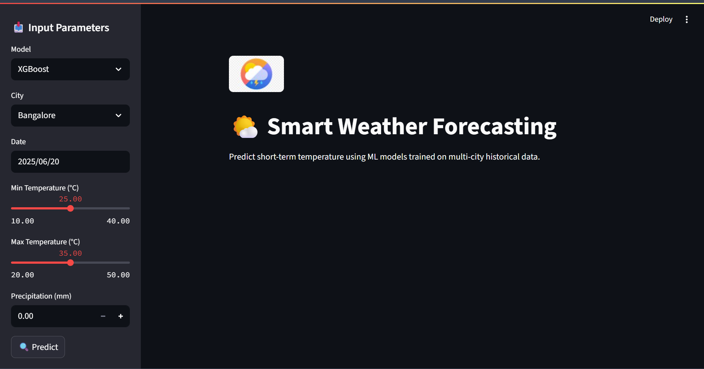
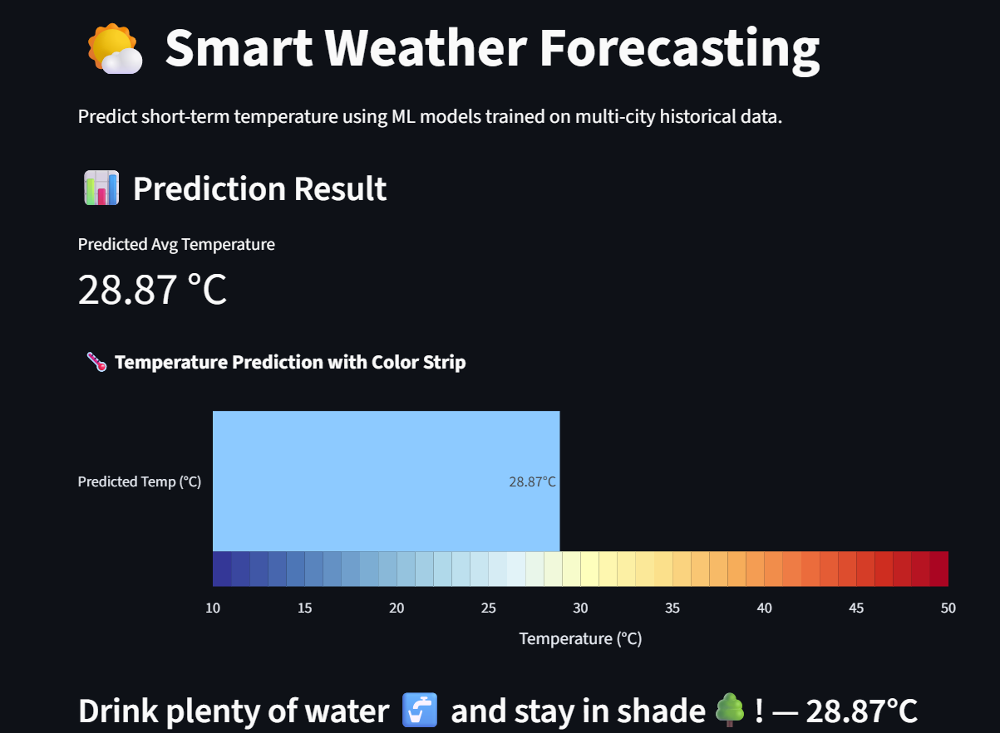
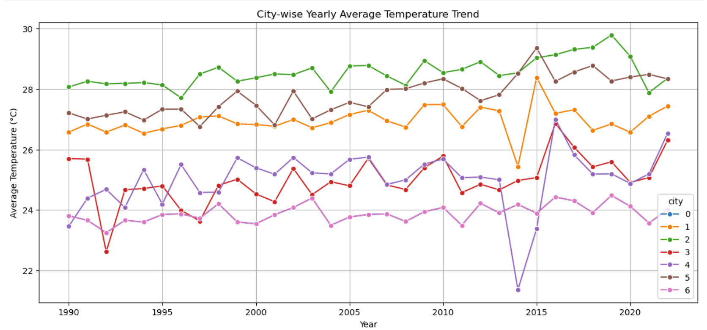

# 🌦️ Short-Term Weather Prediction Using Machine Learning & Streamlit

  
A smart weather prediction web app that uses multiple machine learning models to forecast short-term temperatures for multiple Indian cities.

---

## 📌 Table of Contents
- [🎯 Project Objective](#-project-objective)
- [🧠 Models Used](#-models-used)
- [📊 Visualizations & EDA](#-visualizations--eda)
- [🌐 Tech Stack](#-tech-stack)
- [🧠 What I Learned](#-what-i-learned)
- [📸 Screenshots](#-screenshots)

---

## 🎯 Project Objective

The aim of this project is to build a machine learning-based system that can:
- Predict **next-day average temperature** using historical weather data
- Compare multiple ML models like Linear Regression, SVR, Random Forest, and XGBoost
- Provide an **interactive UI** using Streamlit with:
  - Dynamic temperature graphs
  - Emoji-based interpretations
  - Temperature visual meters with color scale
  - Model-wise accuracy reports

---

## 🧠 Models Used

| Model                  | Why It Was Used                           |
|------------------------|-------------------------------------------|
| Linear Regression      | Simple baseline model                     |
| Support Vector Regressor (SVR) | Good at handling outliers and small datasets |
| Random Forest Regressor | Handles nonlinear relations well         |
| XGBoost Regressor      | Boosted performance with regularization   |

Each model was trained on features:
- Min temperature (`tmin`)
- Max temperature (`tmax`)
- Precipitation (`prcp`)
- City (encoded)
- Date info (day/month/year)

---

## 📊 Visualizations & EDA

- Line plots for yearly temperature trends
- Correlation heatmaps
- Actual vs Predicted temperature plots
- Animated bar meter with color strip 🌡️ (blue → red)
- Emoji-based temperature feedback

---

## 🌐 Tech Stack

- **Python** – Core language for data processing and model building
- **Pandas & NumPy** – Data cleaning, feature engineering, and manipulation
- **Matplotlib, Seaborn, Plotly** – Static and interactive data visualizations
- **Scikit-learn** – ML models like Linear Regression, SVR, Random Forest
- **XGBoost** – Boosted gradient decision trees for high performance
- **Streamlit** – UI framework for deploying interactive ML apps
- **Git & GitHub** – Version control and project hosting

---

## 🧠 What I Learned

- How to clean, combine, and preprocess multi-city time-series weather datasets
- Applied multiple ML regression models and compared their performance
- Tuned hyperparameters and interpreted metrics like RMSE, MAE, R²
- Built a full-fledged Streamlit app with a custom UI and charts
- Used visual tools like emoji indicators, animated gauges, and color strips
- Managed model loading, input handling, and dynamic output generation
- Practiced real-world project structuring, modular code, and GitHub deployment

---

## 📸 Adding Screenshots:

### 🏠 App Homepage

### 📈 Actual vs Predicted Graph (Linear Regression)
.png)

### 📈 Actual vs Predicted Graph (XGBoost)
.png)

### 🌡️ Prediction Output

### 📊 City-wise Yearly Trends

